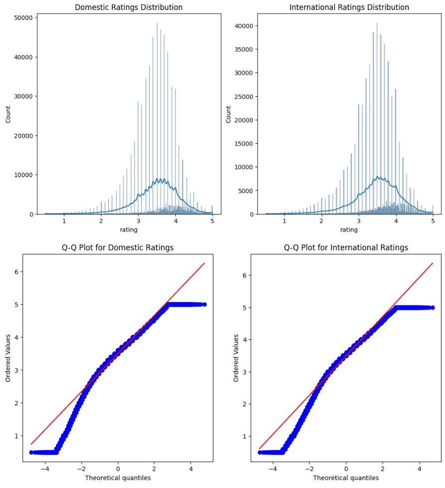

# Global Brews, Local Views: Decoding the World's Beer Preferences

##  **Introduction**

In an era where globalization blends tastes and traditions, beer remains a distinctive symbol of cultural identity and preference. "Global Brews, Local Views" is a deep dive into the effervescent world of beer reviews, where each sip and each rating tells a story not just about the beer, but also about the reviewer. This project is a journey into understanding how personal biases, cultural backgrounds, and national pride shape our perceptions and ratings of beers from around the globe.

##  **The Essence of Our Exploration**

Our mission is to uncork the hidden dynamics in beer ratings, analyzing how a reviewer's personal preferences, their nationality, and their beer review history might skew their ratings. We're not just studying beers; we're exploring how people's backgrounds and biases influence their taste.

##  **Structure and Scope of the Journal**

1. **Unveiling Beer Nations**: We will start by mapping out the beer landscape, identifying countries with high average ratings, and understanding how different aspects like taste and appearance contribute to these ratings. This section will also explore if there's a correlation between a country's beer diversity and its ratings.

2. **International Beer Relations (IBR)**: Here, we will examine the global influence of beers. Which countries' beers are most celebrated abroad? Is there evidence of mutual beer admiration between certain nations? This section aims to unravel the diplomatic ties in the beer world.

3. **Bias in Beer Reviews**: The final section will delve into the psychology of beer reviewers. Are some reviewers consistently more generous or harsh? We will attempt to adjust for these biases and re-evaluate our earlier findings to see if the landscape of beer nations shifts.

##  **Progress and Reflections**: 
This journal will document our progress, challenges, and discoveries. It will be a living record of our exploration into the world of beer ratings, reflecting not only what we learn about beer but also about human nature. Each section will be underpinned by rigorous data analysis. We'll use statistical tools to dissect and interpret the data, ensuring our insights are as robust as they are intriguing.

So, let's raise our glasses to a journey of discovery, where data meets draughts, and insights flow as freely as ale. Welcome to "Global Brews, Local Views"! 🍺

## Question 1: Where are the Beer Nations?

###  **Understanding the Data**

#### **The Source**
Our journey into the world of beer ratings begins with the data sourced from RateBeer, an American website celebrated for its comprehensive and accurate information on beer. RateBeer has established itself as a pivotal online community for craft beer enthusiasts, focusing on beer education and unbiased ratings.

https://www.ratebeer.com/

#### **Rating Dynamics**
On RateBeer, users can rate beers across four key aspects: appearance, aroma, palate, and taste. Additionally, they can provide textual reviews to share their nuanced opinions. Crucially, users can also disclose their country of origin, offering us a valuable dimension for analysis.

###  **Sifting Through the Data**

#### **User Participation**
A preliminary glance reveals a range of user engagement levels. Many users leave only one or a handful of ratings. For our analysis, particularly in identifying favorite beer styles per country, these sporadic ratings offer limited insight.

#### **Threshold for Inclusion**
To ensure meaningful and reliable conclusions, we adopt a dual threshold approach. Users with fewer than eight ratings and countries represented by fewer than ten users are filtered out. This balance between data abundance and quality is crucial for our analysis.

###  **Examining the Remaining Countries**

#### **Diverse Participation**
Post-filtration, we're left with a globally diverse set of countries, each with a significant user base contributing to the beer ratings. This allows us to delve into the data with confidence, knowing that our insights will be representative of a broader spectrum of beer enthusiasts.

#### **Upcoming Analyses**
Our next steps involve deep dives into understanding the favorite beer styles in these countries, exploring regional preferences, and uncovering global trends. We aim to paint a picture not just of the beers themselves, but of the cultural and personal preferences that shape the world's beer landscape.

###  **A Toast to Data-Driven Insights**
This initial stage sets the groundwork for our exploration into the "Beer Nations." It's a celebration of diversity, both in beer styles and in the global community of those who love them. Let's raise our glasses to the insights awaiting us in the pages ahead!

### **Let's investigate Beer nations**
The concept of "Beer Nations" can be explored by examining countries with a high number of breweries and a diverse range of beer styles. Typically, countries like Belgium, Germany, and the United States are renowned for their beer culture. By analyzing the distribution of breweries and the variety of beer styles, we will identify which countries stand out as prominent beer producers and connoisseurs.

The United States leads significantly in brewery count (41,152) and style diversity (167). This suggests a highly developed and diverse beer industry, likely offering a wide range of beer experiences from mass-produced to craft and specialty beers. Belgium and Germany, known for their beer culture, show a good balance of brewery count and style diversity (Belgium: 1,369 breweries, 130 styles; Germany: 2,131 breweries, 149 styles). This aligns with their reputation for quality and variety in beer production. High brewery count and style diversity in countries like Canada and the UK also indicate thriving beer industries. The data reveals a correlation between a country's beer culture's maturity and its diversity in beer styles.

### ***Now let's look at the ratings by country***
Some countries might excel in specific aspects, like the robust taste profiles of Belgian ales or the refined appearance of German lagers. This analysis will help in understanding which countries' beers are most favored by enthusiasts and critics alike.

Slovenia, with high average ratings across taste, aroma, appearance, palate, and overall (around 4.6 for taste and aroma), suggests an exceptionally high quality of beer, potentially indicating a niche, high-quality beer market. Japan's high ratings (average taste rating of 4.5) indicate a preference for quality and unique flavors in their beer industry. The presence of countries like Malaysia and Tanzania with higher-than-expected ratings might suggest emerging markets with developing tastes or unique local beer styles gaining popularity.

### ***Let's now analyse the popular beer styles by country***
The results might reflect traditional preferences, like the popularity of stouts in Ireland or IPAs in the United States, or could uncover emerging trends in global beer tastes.

The United States shows a diverse range of popular beer styles with high ratings, especially for American IPA (average rating of 3.98) and Imperial Stout (3.86). This diversity reflects the dynamic and innovative nature of the American beer market. The UK and Belgium also show diversity in popular styles, with high ratings in categories like Imperial Stout and Belgian Strong Ale, reflecting their traditional strengths. The data reflects a blend of traditional and modern styles, indicating a global trend towards variety and experimentation in beer production.

### ***Finally, let's try to find a correlation between breweries, diversity and ranking***
An analysis of the correlation between the number of breweries, diversity of beer types, and overall beer ratings in each country is an insightful undertaking. This involves examining whether countries with more breweries and a wider range of beer styles tend to have higher overall ratings for their beers. Such a correlation, if present, could suggest that a vibrant, competitive brewing scene fosters higher quality and innovation in beer production.

**Correlation Between Brewery Count and Style Diversity:** The correlation coefficient is 0.707. This is a strong positive correlation, suggesting that countries with more breweries tend to also have a greater diversity of beer styles. This relationship implies that as the beer industry in a country expands in terms of the number of breweries, there is a parallel increase in the variety of beer styles produced. It indicates a thriving beer culture where expansion leads to innovation and variety.

**Correlation Between Brewery Count and Average Overall Rating:** The correlation coefficient is 0.464. This is a moderate positive correlation. It implies that countries with more breweries tend to have higher average overall ratings for their beers, although the relationship is not as strong as with style diversity. This could suggest that having more breweries contributes to better quality beers, possibly due to increased competition, a greater exchange of brewing techniques, or a wider selection for consumers.

**Correlation Between Style Diversity and Average Overall Rating:** The correlation coefficient is 0.306. This is a positive but relatively weak correlation. It indicates that a greater diversity of beer styles has some association with higher average overall ratings, but other factors may play a more significant role in determining beer quality. This could mean that simply having a wide variety of beer styles is not a strong predictor of overall beer quality as perceived by consumers or critics.

## IBR - International Beer Relations

###  **Exploring the Geography of Beer**

#### **Understanding International Beer Dynamics**
In our quest to explore the international relations in the beer world, we delve into four intriguing aspects:
1. The origins of the majority of ratings for each nation's beers.
2. The global popularity of certain countries' beers.
3. The existence of a 'Beer Union' - countries mutually appreciative of each other's brews.
4. The presence of domestic beer pride - do users favor beers brewed in their home country?

#### **Data Cleaning and Preparation**
Before delving into these questions, our first step is data cleaning and preparation. By mapping user and brewery locations to our ratings dataset, we distinguish between local and international ratings.

### **Local vs. International Beer Appreciation: A Closer Look**

#### **The American Influence in Beer Ratings**
A striking aspect of our data analysis reveals the substantial influence of the United States in the beer rating world. This dominance is twofold:
- **Domestic Ratings**: American users lead in reviewing beers produced within the United States, with an astonishing 472,769 ratings.
- **International Focus**: Interestingly, American users are also prolific in rating international beers. A notable example is Belgian beers, which received 51,241 ratings from U.S. users.

#### **Top Rating Dynamics**
The analysis uncovers the top types of beer ratings based on their volume, illustrating a clear trend in user preferences and access:
- **U.S. Dominance in Domestic Reviews**: The majority of reviews are from U.S. users rating U.S. beers, indicating a strong domestic market.
- **Cross-Cultural Appreciation**: Belgian beers are highly rated by U.S. users, second only to their domestic ratings, suggesting a keen American interest in Belgian brews.
- **Canadian and UK Loyalties**: Canadian users predominantly rate Canadian beers (46,059 ratings), and UK users show a similar trend with 32,263 ratings for UK beers.

#### **Understanding Review Patterns**
This pattern where most reviews for each brewery come from users in the same country aligns with expectations - domestic users typically have greater access to their local brews. However, the dataset shows a significant skew towards U.S. users, reflected in the volume of their reviews, both domestic and international.

#### **Implications of Data Skew**
Such a skew suggests that the dataset may not fully represent global beer preferences but is heavily influenced by American users' activity on the review website. For instance, while there are more reviews of Belgian beers by U.S. users than by Belgians themselves, this likely reflects the higher number of American users on the platform rather than a definitive statement about the popularity of Belgian beers in the U.S.

#### **Mapping Beer Diplomacy**
By visualizing these international beer relations, we shed light on how beer appreciation transcends borders. The web of ratings paints a picture of global beer diplomacy.

###  **Which Country’s Beers Win Hearts Worldwide?**
Our analysis uncovers that Belgium, the US, and the UK lead in terms of international review counts. However, when we consider the proportion of international reviews, non-English speaking countries surprisingly emerge as significant players in the global beer scene.

## International Review Count and Proportion

### **Exploring Global Beer Ratings**

#### **Diving into Global Beer Appreciation**
In our exploration of international beer ratings, we first examine countries with the highest volume of reviews. Additionally, we compare these figures with the number of international reviews these countries receive. This analysis is crucial to understanding the global reach and appeal of various beers.

#### **Belgium's Dominance in International Reviews**
It's interesting to note that Belgian beers lead in international reviews, followed by the United States and the United Kingdom. This indicates a significant global interest in Belgian beers, reflecting their widespread popularity and appeal.

#### **Proportional Analysis of International Reviews**
An intriguing aspect of our analysis is looking at the proportion of international reviews in relation to total reviews. Here, we observe that non-English speaking countries generally have a higher proportion of international beer reviews. This trend is particularly notable given that the dataset predominantly consists of English-language reviews, yet it showcases the global appeal of beers from various linguistic backgrounds.

#### **The United States: A Closer Look at Proportions**
Despite the United States having a high number of international reviews, its proportion of international reviews is relatively low compared to other countries. This finding suggests that the bulk of the dataset's beer reviews might be heavily influenced by American users.

### **International Review Ratings**

#### **Global Scale of Beer Popularity**
Moving beyond just review counts, we delve into another dimension of beer popularity - the average ratings that beers receive abroad. We hypothesize that higher ratings correlate with greater preference and popularity.

#### **Surprises in International Ratings**
An analysis of the top countries in terms of average international ratings brings some unexpected results. Countries traditionally not known as major beer nations are leading in popularity, according to international ratings.

#### **Surprises in International Ratings**
An analysis of the top countries in terms of average international ratings brings some unexpected results. Countries traditionally not known as major beer nations are leading in popularity, according to international ratings.

#### **Iran's Unique Position**
One of the most surprising findings is Iran's position as a highly-rated beer nation based on international ratings. Considering that the production and distribution of alcoholic beer have been illegal in Iran since 1979, this high ranking is attributed to non-alcoholic beers. Iran's presence in this list highlights the diverse and sometimes unexpected trends in global beer appreciation.

###  **Uncovering the Beer Union**
To probe the existence of a 'Beer Union', we utilize network analysis. This method illustrates the beer rating relationships between countries. Interestingly, the data reveals isolated instances of mutual beer appreciation rather than a broad 'Beer Union'. The United States, due to the data skew, appears as a central node in this network.

##  Is There a Beer Union? Exploring Mutual Enthusiasm for Beer

### **Beer Diplomacy: Understanding Global Beer Relationships**

#### **Mapping the World of Beer Appreciation**
We've explored the geography of beer through our dataset, but let's switch gears to the diplomacy of beer. Is there a sense of mutual appreciation among countries for each other's beers? To find out, we're venturing into a unique network analysis.

#### **Creating a Global Beer Network**
Here's how we're mapping this out:
- **Nodes Represent Countries**: Each country in our dataset becomes a node in our network.
- **Edges Symbolize Beer Relationships**: The connections between these countries (edges) represent the beer rating relationships.
- **Average Ratings as Edge Weights**: These connections are weighted based on the average rating users from one country give to beers from another.

### **Visualizing International Beer Connections**

#### **The United States: A Central Node**
Our network graph is quite revealing, especially when we apply a high threshold for average beer ratings (3.75). It turns out, the United States is a major player, acting as the predominant node. This centrality reflects the American-centric nature of our data sources.

#### **Selective International Beer Appreciation**
The connections we observe in the graph are quite selective. The sparse but present connections between the U.S. and various other countries hint at a selective international appreciation for quality beers.

#### **Isolated Pockets of Mutual Beer Enthusiasm**
Contrary to the idea of a widespread 'Beer Union', the network shows isolated pockets of mutual beer enthusiasm. Inter-country connections outside the U.S. are few, suggesting that while there are instances of mutual appreciation, they are not as widespread as one might have initially thought.

#### **Rethinking the 'Beer Union' Concept**
The concept of a 'Beer Union', where countries broadly appreciate each other's beers, seems more idealistic than realistic! This exploration into beer diplomacy opens up new perspectives on how different countries interact over a shared love for beer. While the connections may not be as extensive as a union, they certainly paint an interesting picture of global beer dynamics.

##  Is There Domestic Beer Pride? Analyzing Home Country Bias in Beer Ratings

### **Exploring the Bias Towards Domestic Beers**

#### **The Concept of Local Pride in Beer Ratings**
It's common for people to support and enjoy products from their own country, and this includes beer. But does this lead to a bias in how they rate domestic beers compared to international ones? Let's dive into the data and compare the average ratings for domestic and international beers to find out.

### **Breaking Down the Ratings**

#### **Comparing Average Ratings: Domestic vs. International**
Here's what we found:
- **Average Domestic Rating**: 3.5005
- **Average International Rating**: 3.4876

Interestingly, the average domestic rating is slightly higher than the international rating. While this margin might seem small, it points towards a subtle preference for domestic beers.

### **Statistical Significance: Is the Difference Real?**

#### **Putting the Numbers to the Test**
To determine if this difference is just by chance or something more, we're performing a Welch's t-test. This test helps us figure out if the difference in ratings is statistically significant.

#### **Results of the Welch's T-Test**
Given our large sample size and the robustness of Welch's t-test (which can handle unequal variances and deviations from normality), the test concludes that the difference in ratings is indeed statistically significant.

### **Conclusions on Domestic Beer Ratings**

#### **Understanding the Preference for Local Brews**
This analysis suggests that there is indeed a slight but real bias towards domestic beers. Users seem to rate beers from their home country marginally higher than those from other countries.

#### **Reflecting on Beer Rating Behavior**
These findings shed light on the subtle ways in which national pride and local preference can influence our perceptions and ratings of beer. It's a fascinating glimpse into the psychological aspects of beer appreciation that go beyond just taste and quality.

## Are beer reviewers the biggest bias?

#### ***Lets take a closer look at the ratings data*** 

To gain an initial advantage, we begin by identifying the top 10 users boasting the highest volume of reviews, and proceed to visualize the distribution of their ratings. This preliminary examination serves as a swift and essential sanity check.

Top 10 users in terms of the number of reviews in order to get do a qualitative visual comparasion of their rating statistics:

#### ***How are we going to identify nice users ?*** 

We establish the criteria for categorizing users as 'nice users,' defined as individuals who consistently provide ratings above a specified threshold. The process involves the following steps:

**Rating Threshold Definition:** Initially, we set a rating threshold (3/5), considering ratings above this threshold as 'good.'

**Counting 'Bad' Ratings:** Subsequently, we tally the number of 'bad' ratings (those falling below the defined threshold) for each user. We compute the ratio of 'bad' ratings to the total number of ratings per user.

**Percentage Threshold Application:** If the computed ratio is below a predetermined percentage threshold (set at 15%), the user qualifies as a potential 'nice user.'
Consistency Check.

**ADF Test:** To further ascertain if the user consistently provides good ratings, we conduct an Augmented Dickey-Fuller (ADF) test on the user's rating data. The Null Hypothesis of the ADF test posits that the time series is non-stationary. Consequently, a sufficiently small P-value leads to the rejection of the null hypothesis.

**Nice User Identification:** Users meeting the criteria in steps 3 and 4 are identified as nice users.

This comprehensive approach ensures a rigorous evaluation of users based on both their rating patterns and the statistical properties of their rating time series, contributing to the identification of consistently positive contributors to the platform. The above analysis results in a total of 1419 nice users. 

### ***Sentimental analysis on text reviews is a viable solution***
In the section below, the entimental information is extracted from the reviewer's text in a scale which would be comparable to the user ratings of the beers. As a proof of conecpt, the reviews of only one user is chosen to be anaylzed, since the method is extendable to the whole dataset. For this purpose BERT Mutilingual Sentimental Analysis pretrained model is used. This model is trained on wikipedia pages of 104 languages. The reason of this choice is to cover as many languages possible. For more information on BERT: https://huggingface.co/nlptown/bert-base-multilingual-uncased-sentiment. By pure coincidence, the sentimental scale used by this classifier (0-5) is the same scale as the beer ratings, with the difference of being categorical.

For a sanity check, we first take a small subset of the first 5 nice users:

The resulting distributions can be seen below: 

### 📝***Lets Correcting reviewers niceness by a balancing formula***
A balancing metric is required to even out the inherent biases of the reviewers between putting down an actual score or writing their opininon in text. As displayed above this bias becomes apparent whilst comparing the ratings of a given reviewer with the perceived sentiment from their written review text. The **interpolated rating (ir)** can be expressed with the balancing formula as:

$$  ir_i = {rating_i*(1-\alpha) + sentiment\_rating_i*\alpha } $$

Where for a given user *ratings* represent the given score by the reviewer, *sentiment_rating* the sentimenal analysis score, *i* the index, and $\alpha\in[0,1]$ a balancing coefficient which has to be defined as below: 
    
- if the distributions of *ratings* & *sentiment_rating* are **close enough** $$\alpha = 0.5$$ 
- if the reviewer tends to **overrate** according to the *ratings* & *sentiment_rating* distribution differences  $$\alpha > 0.5$$
- if the reviewer tends to **underrate** according to the *ratings* & *sentiment_rating* distribution differences  $$ \alpha < 0.5$$
The final comparison of the initial ratings, sentimental analysis score on the text, and the interpolated rating  can be found below:

### ***How does the interpolated ratings effect the beer nations***

Unfortunately, the extension of this balancing metric to the entire dataset was impeded by constraints on computational resources. Consequently, we were unable to replicate the analysis conducted in the initial step, hindering our ability to observe the impact of the balanced ratings on the results and draw comparisons with the initial findings. Despite this constraint, the localized application of the balancing metric to a subset or specific user categories could still yield valuable insights and provide a foundation for future analyses..

